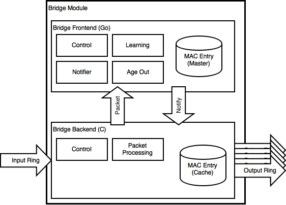

bridge module
~~~~~~~~~~~~~~

Layer2 レベルのパケットを処理するモジュールである。

高速に処理すべきパケット処理部は C で記述し、それほど性能を要求されない MAC アドレスの学習などは Go で記述されている。
C で書かれているパケット処理部をバックエンド、Go で書かれた制御部をフロントエンドと呼ぶ。
フロントエンドとバックエンド間は DPDK Ring で繋がれており、それぞれ非同期に処理を行うことが可能になっている。

フロントエンドからバックエンドは MAC エントリの追加・削除といった制御メッセージが送られる。
バックエンドからフロントエンドには、生の DPDK Mbuf が送られる。

フロントエンド側は、以下の Go routine から構成され、それぞれチャネルでコミュニケーションをする:

* 学習、エイジアウト処理、MAC エントリの管理を行うラーニング用ルーチン
* バックエンドから受け取った DPDK Mbuf をラーニング用ルーチンに渡すルーチン
* ラーニング用ルーチンからの指示をバックエンドに伝えるルーチン

データプレーン制御側からの指示は全てチャネルを通して、ラーニング用ルーチンに渡し、チャネルで結果を返す。
つまり、全ての処理がラーニング用ルーチンにおいてシリアライズされる。
これによりロックフリーによるデータ管理を実現している。

バックエンド側は、DPDK のスレーブ・コアを独占し、以下の処理を逐次的に実行するため、ロックフリーにより処理が行えるようになっている:

* 入力 DPDK Ring からのパケットの読み込み
* ルールに基づくパケットのディスパッチ
* フロントエンド側へのパケットの転送
* フロントエンド側からの指示の処理

モジュール機能一覧
^^^^^^^^^^^^^^^^^^

本モジュールとしては以下の機能を実現する:

* モジュールの制御 (Go)
* 入力パケットを元に MAC アドレスの学習 (Go)
* 学習した MAC アドレスのエイジアウト処理 (Go)
* 送出先 MAC アドレスに基づく送出先の決定 (C)
* 受領したパケットの転送 (C)

モジュールの制御
^^^^^^^^^^^^^^^^

本モジュールは以下のモジュール・インスタンスの ``Control()`` に対応する:

``SET_CONFIG``
	VRF 毎の MAC エントリの学習設定を行う。引数は ``bridge.Config`` 型の構造体である。
	最低１つは VRF が登録されている必要がある。返値は bool 型。

``GET_CONFIG``
	指定した VRF ID (uint64) の設定情報を取得する。返値は ``bridge.Config`` 型。

``DELETE_CONFIG``
	指定した VRF ID (uint64) の設定情報を削除する。返値は bool 型。

``ADD_MAC_ENTRY``
	MAC エントリを追加する。引数は ``bridge.MacEntry`` 型。返値は bool 型。

``DELETE_MAC_ENTRY``
	MAC エントリを削除する。引数は ``bridge.MacEntry`` 型。返値は bool 型。

なお、``ADD_MAC_ENTRY`` および ``DELETE_MAC_ENTRY`` で追加・削除された MAC アドレスの情報は、随時バックエンドに通知される。
また、追加されたエントリはエイジアウト処理の対象外とされる。

MAC アドレスの学習
^^^^^^^^^^^^^^^^^^

受け取った DPDK Mbuf を解析し、ソースの MAC アドレス、VRF ID、VIF インデックスを取り出し、Expire 予定時刻を付けて、エントリを作成する。

生成したエントリは、Hash List で管理する。
新規のエントリの場合は単にリストの最後につける。
既に存在するエントリの場合は、ハッシュでリスト上の要素を見つけ、リストの最後に回す。
これにより、常にリストは古いものから新しいものへと時系列に並ぶ。

新規に追加されたエントリが追加された場合は、MAC アドレス、VRF ID、VIF インデックスのタプルをセットにし、バックエンドへ通知する。

MAC アドレスのエイジアウト処理
^^^^^^^^^^^^^^^^^^^^^^^^^^^^^^

MAC アドレスのエイジアウト処理は、3 秒ごとに行われる。

エイジアウト処理には、MAC エントリのリストを先頭から見ていき、その時点よりも前に Expire 予定時刻が来ているものを随時削除する。
Expire 予定時刻が未来のエントリに当たった時点で処理は終了する。

削除されたエントリは、バックエンドに通知する。

送出先の決定
^^^^^^^^^^^^

入力パケットは、以下のルールで送出先がバックエンドにおいて決定される。

* 自宛のパケット(DPDK Mbuf のメタ情報により判定)の場合、``vswitch.MATCH_ETH_DST_SELF`` で指定された先
* 自宛ではない場合、MAC エントリのキャッシュを探索し、エントリが見つからない場合は全 VIF (Flooding)
* エントリが見つかった場合は指定された VIF

なお、Flooding の場合は、DPDK Mbuf のリファレンス・カウンタを「VIF の数 -1 」増やす。

*TODO* 現時点では、バックエンドは VRF 未対応

受領したパケットの転送
^^^^^^^^^^^^^^^^^^^^^^

バックエンドで受け取ったパケットは、リファレンス・カウンタを 1 増やした上で、フロントエンドに転送する。

*TODO* VIF 以外から来たパケットも転送しているため、VIF 以外からのパケットは転送しないようにする必要がある。
